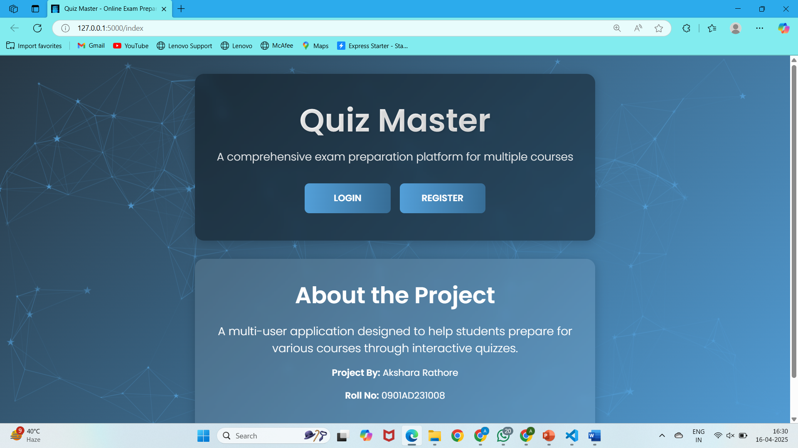
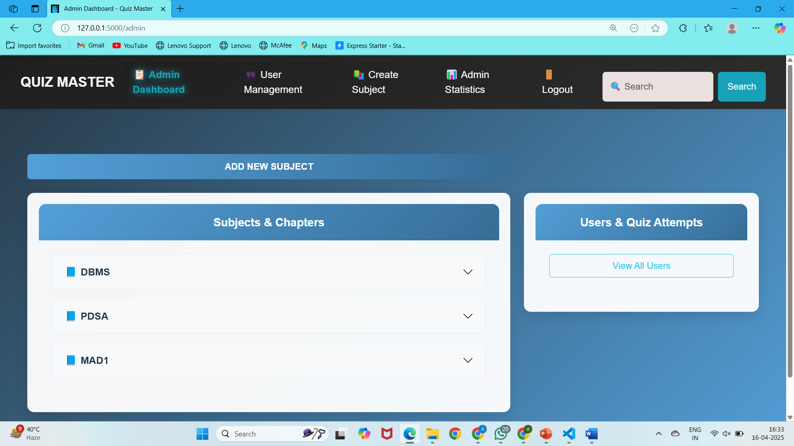
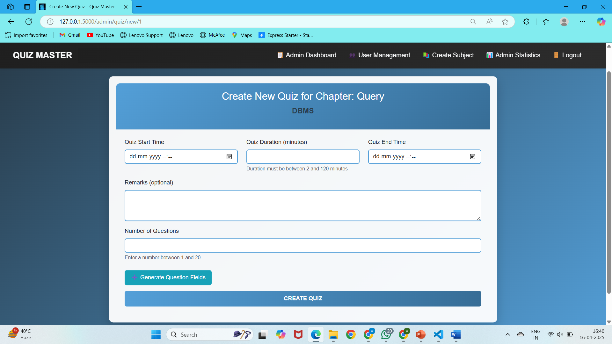
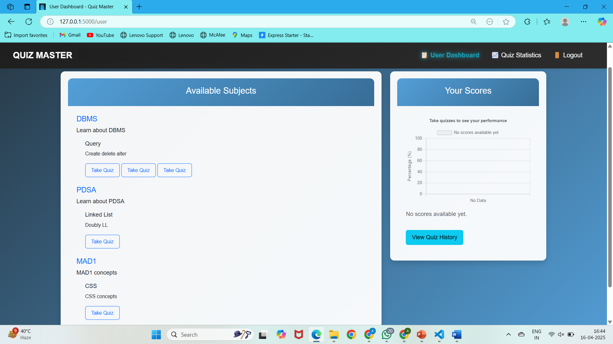
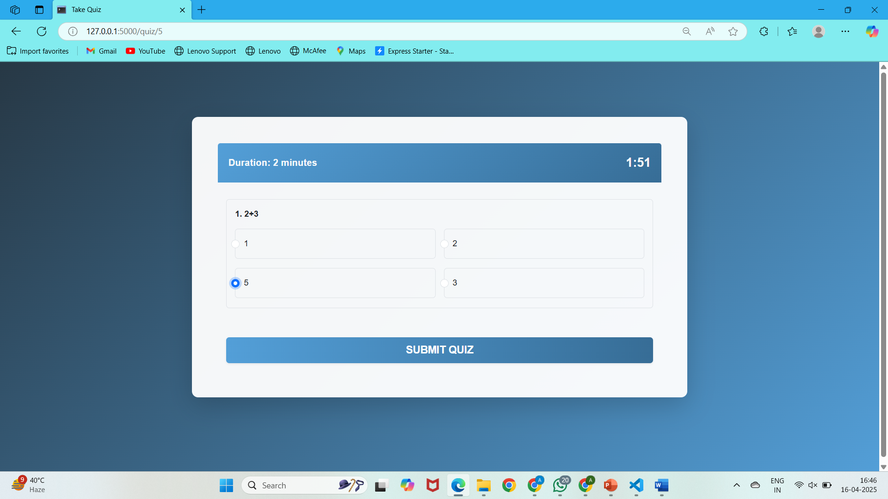
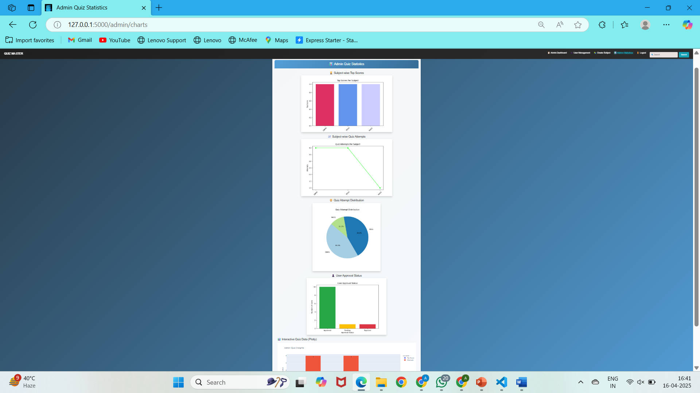
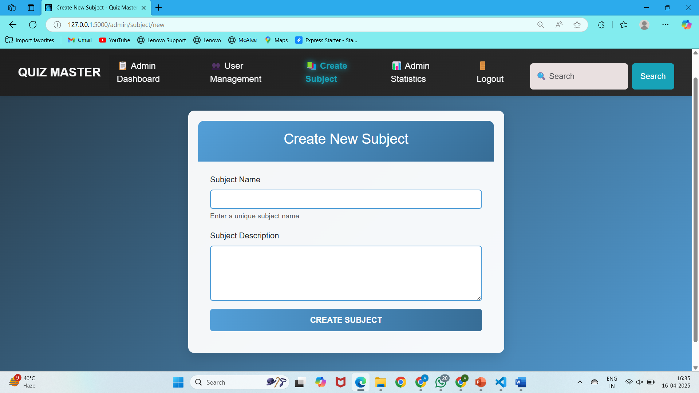
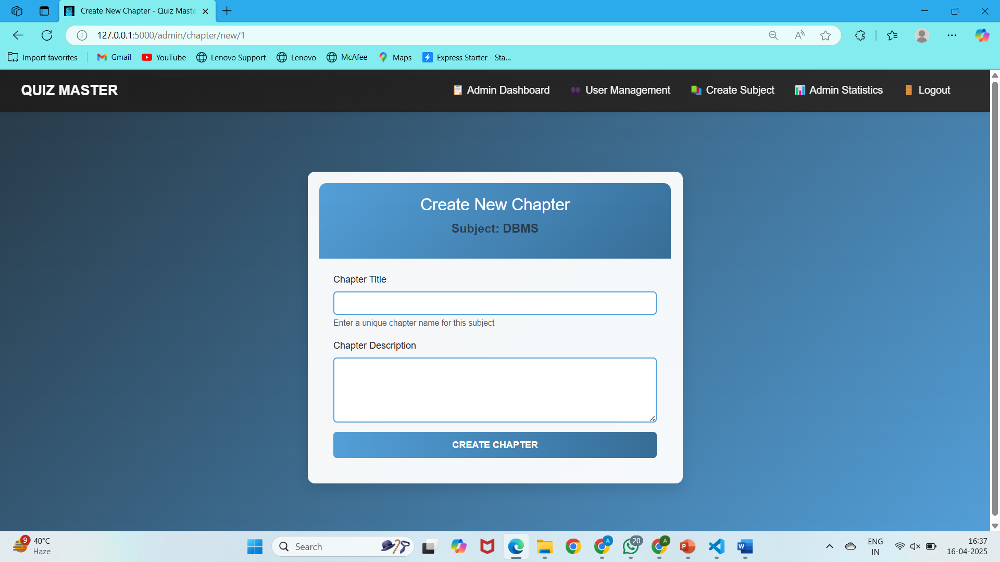

# QuizMaster 📚✨

<div align="center">
  
  <h3>A comprehensive educational quiz platform </h3>
</div>

<div align="center">

[](https://flask.palletsprojects.com/)
[](https://www.python.org/)
[](https://www.sqlalchemy.org/)
[](LICENSE)

</div>

## 📋 Overview

QuizMaster is a powerful educational platform that creates a complete quiz ecosystem for educational institutions. The application enables administrators to create and manage educational content while allowing students to take quizzes and track their performance through intuitive visualizations and analytics.

## ✨ Features

### 👩‍💼 Administrator Features

- **User Management**
  - Approve or reject user registrations
  - Manage user accounts and permissions

- **Content Management**
  - Create subject hierarchies with chapters
  - Design timed quizzes with multiple-choice questions
  - Organize educational content systematically

- **Analytics Dashboard**
  - View detailed quiz analytics through interactive charts
  - Track key metrics (quiz attempts, completion rates, average scores)
  - Monitor user activity and engagement
  
- **Search Functionality**
  - Quickly find content across the platform

### 👨‍🎓 Student Features

- **Personalized Dashboard**
  - View available subjects and quizzes
  - Track quiz attempts and performance
  - Visualize progress through charts

- **Quiz Experience**
  - Take timed quizzes with immediate feedback
  - Review correct answers and explanations
  - Track score progression over time

- **Performance Analytics**
  - Visualize progress through various chart types
  - Compare performance across different subjects
  - Identify strengths and areas for improvement

## 📸 Screenshots

<div align="center">
  <div style="display: flex; flex-wrap: wrap; justify-content: center; gap: 20px;">
    <div style="flex: 1; min-width: 300px; max-width: 45%;">
      
      <p><em>HOME</em></p>
    </div>
  </div>
  
  <div style="display: flex; flex-wrap: wrap; justify-content: center; gap: 20px;">
    <div style="flex: 1; min-width: 300px; max-width: 45%;">
      
      <p><em>Admin Dashboard</em></p>
    </div>
    <div style="flex: 1; min-width: 300px; max-width: 45%;">
      
      <p><em>Quiz Creation Interface</em></p>
    </div>
  </div>
  
  <div style="display: flex; flex-wrap: wrap; justify-content: center; gap: 20px; margin-top: 20px;">
    <div style="flex: 1; min-width: 300px; max-width: 45%;">
      
      <p><em>Student Dashboard</em></p>
    </div>
    <div style="flex: 1; min-width: 300px; max-width: 45%;">
      
      <p><em>Quiz Taking Interface</em></p>
    </div>
  </div>
  
  <div style="display: flex; flex-wrap: wrap; justify-content: center; gap: 20px; margin-top: 20px;">
    <div style="flex: 1; min-width: 300px; max-width: 45%;">
      
      <p><em>Performance Analytics</em></p>
    </div>
    <div style="flex: 1; min-width: 300px; max-width: 45%;">
      
      <p><em>Subject Management</em></p>
    </div>
  </div>
  
  <div style="display: flex; flex-wrap: wrap; justify-content: center; gap: 20px; margin-top: 20px;">
    <div style="flex: 1; min-width: 300px; max-width: 45%;">
      
      <p><em>Chapter Management</em></p>
    </div>
  </div>
</div>

## 🔧 Technologies Used

- **Backend**
  - Flask: Web framework for handling requests, routing, and template rendering
  - Flask-SQLAlchemy: ORM for database operations
  - Flask-Login: User authentication and session management
  - Flask-WTF: Form handling and validation
  - Werkzeug: Password hashing and security utilities

- **Frontend**
  - Jinja2: Template engine
  - Bootstrap: Responsive UI components and styling
  - JavaScript/jQuery: Client-side interactions and validations
  - Chart.js/Plotly.js: Interactive data visualizations

- **Database**
  - SQLite: Development database
  - (Optional) PostgreSQL: Production database

- **Data Visualization**
  - Matplotlib
  - Seaborn
  - Plotly

## 🚀 Installation and Setup

### Prerequisites
- Python 3.8+
- pip (Python package manager)
- virtualenv (recommended)

### Installation Steps

1. **Clone the repository**
   ```bash
   git clone https://github.com/yourusername/quizmaster.git
   cd quizmaster
   ```

2. **Create and activate virtual environment**
   ```bash
   python -m venv venv
   
   # On Windows
   venv\Scripts\activate
   
   # On macOS/Linux
   source venv/bin/activate
   ```

3. **Install dependencies**
   ```bash
   pip install -r requirements.txt
   ```

4. **Set up environment variables**
   ```bash
   # On Windows
   set FLASK_APP=run.py
   set FLASK_ENV=development
   
   # On macOS/Linux
   export FLASK_APP=run.py
   export FLASK_ENV=development
   ```

5. **Initialize the database**
   ```bash
   flask db init
   flask db migrate -m "Initial migration"
   flask db upgrade
   ```

6. **Create admin user**
   ```bash
   flask create-admin
   ```

7. **Run the application**
   ```bash
   flask run
   ```

8. **Access the application**
   Open your browser and navigate to `http://127.0.0.1:5000`

## 📊 Project Structure

```
quizmaster/
├── app/
│   ├── __init__.py
│   ├── config.py
│   ├── models.py
│   ├── routes/
│   │   ├── __init__.py
│   │   ├── admin.py
│   │   ├── auth.py
│   │   └── student.py
│   ├── static/
│   │   ├── css/
│   │   ├── js/
│   │   └── images/
│   ├── templates/
│   │   ├── admin/
│   │   ├── auth/
│   │   └── student/
│   └── utils/
│       ├── __init__.py
│       ├── analytics.py
│       └── helpers.py
├── migrations/
├── tests/
├── venv/
├── .gitignore
├── requirements.txt
├── run.py
└── README.md
```

## 🔐 Security Features

- Password hashing using Werkzeug's security module
- Role-based access control
- Form validation and CSRF protection
- Input sanitization and validation
- Session management and secure cookies

## 📝 Usage

### Admin User

1. Log in with admin credentials
2. Navigate to the admin dashboard
3. Create subjects, chapters, and quizzes
4. Manage user registrations
5. View analytics and reports

### Student User

1. Register for an account (requires admin approval)
2. Log in with approved credentials
3. Browse available subjects and quizzes
4. Take quizzes within the time limit
5. View performance analytics and progress charts

## 🤝 Contributing

1. Fork the repository
2. Create your feature branch (`git checkout -b feature/amazing-feature`)
3. Commit your changes (`git commit -m 'Add some amazing feature'`)
4. Push to the branch (`git push origin feature/amazing-feature`)
5. Open a Pull Request

## 📜 License

This project is licensed under the MIT License - see the [LICENSE](LICENSE) file for details.

## 📬 Contact

Feel free to reach out if you have any questions or feedback:

- **Email**: itsAksharaRathore@gmail.com
- **GitHub**: [ItsAksharaRathore](https://github.com/ItsAksharaRathore)
- **LinkedIn**: [Akshara Rathore](https://www.linkedin.com/in/itsAksharaRathore)

---

<div align="center">
  <p>Made with ❤️ for education</p>
</div>